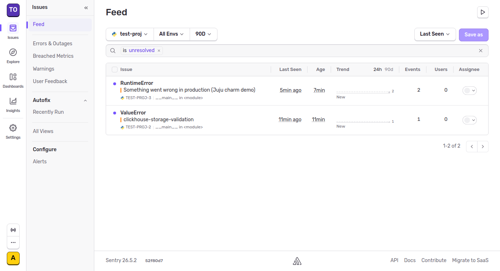
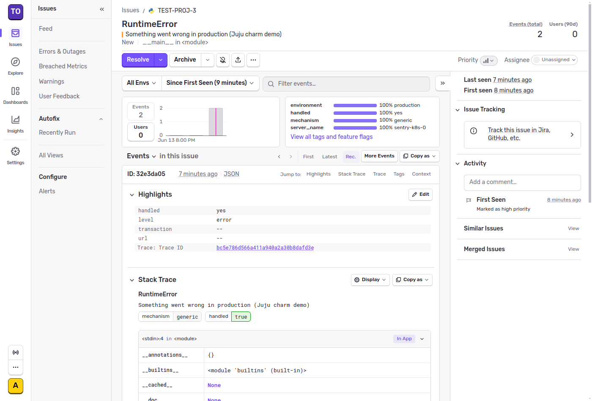

# Self-hosted Sentry on Juju: an end-to-end demo

*2026-06-13T22:28:17Z by Showboat 0.6.1*
<!-- showboat-id: 0355551e-8d8c-461c-8f11-72943870102d -->

This repository packages [self-hosted Sentry](https://develop.sentry.dev/self-hosted/) as a set of Juju charms. Six applications cooperate to receive, process, store and display error events:

- **clickhouse-k8s** - columnar event store
- **sentry-snuba-k8s** - the search/storage service in front of ClickHouse
- **sentry-relay-k8s** - the event-intake front door
- **sentry-k8s** - the Sentry web UI, workers and ingest consumers
- plus related **postgresql-k8s**, **redis-k8s** and **kafka-k8s**

The demo below sends a *real* error event into the running deployment and follows it all the way through the pipeline into an issue. Every code block is executed and its output captured with [showboat](https://pypi.org/project/showboat/), so the demo doubles as reproducible proof.

## The deployed charms

All six applications are integrated and active:

```bash
juju status | grep -E "^(App|clickhouse-k8s|kafka-k8s|postgresql-k8s|redis-k8s|sentry-k8s|sentry-relay-k8s|sentry-snuba-k8s) "
```

```output
App               Version                      Status  Scale  Charm             Channel      Rev  Address         Exposed  Message
clickhouse-k8s    25.3.6.10034.altinitystable  active      1  clickhouse-k8s                   1  10.152.183.210  no       
kafka-k8s         3.9.0                        active      1  kafka-k8s         3/stable      82  10.152.183.132  no       
postgresql-k8s    14.20                        active      1  postgresql-k8s    14/stable    774  10.152.183.127  no       
redis-k8s         7.2.5                        active      1  redis-k8s         latest/edge   42  10.152.183.91   no       
sentry-k8s                                     active      1  sentry-k8s                       3  10.152.183.242  no       
sentry-relay-k8s                               active      1  sentry-relay-k8s                 0  10.152.183.177  no       
sentry-snuba-k8s                               active      1  sentry-snuba-k8s                 3  10.152.183.95   no       
```

## Sending a real event

An application reports an error by sending it to its DSN. Here we raise an
exception and let the Sentry SDK deliver it to the **Relay** charm — exactly
what an instrumented production app does. ([`demos/send_test_event.sh`](send_test_event.sh))

```bash
./demos/send_test_event.sh 2>/dev/null
```

```output
Sent event 32e3da05fc0f45bab5ad958620c27c7a to sentry-relay-k8s.testing.svc.cluster.local:3000
```

## Following the event through the pipeline

The event travels **Relay → Kafka (`ingest-events`) → Sentry ingest consumers → a Postgres issue**, and in parallel **Sentry → Kafka → Snuba → ClickHouse** for storage and search. ([`demos/check_pipeline.sh`](check_pipeline.sh))

```bash
./demos/check_pipeline.sh 2>/dev/null
```

```output
1. Kafka 'ingest-events' topic (Relay publishes here):
   ingest-events:0:4

2. Issues recorded in Postgres (created by the Sentry consumers):
   issue #1  seen 1x  RuntimeError: end-to-end-validation-via-relay
   issue #2  seen 1x  ValueError: clickhouse-storage-validation
   issue #3  seen 2x  RuntimeError: Something went wrong in production (Juju charm dem

3. Event rows stored in ClickHouse (written by the Snuba consumer):
      ┌─events─┬──────────────latest─┐
   1. │      3 │ 2026-06-13 22:29:10 │
      └────────┴─────────────────────┘
```

## Seeing it in the Sentry UI

Logging in to the Sentry web service (served by the **sentry-k8s** charm) shows the two errors grouped into issues, exactly as they were sent:

```bash {image}

```



Opening an issue shows the captured event — event id, server name (`sentry-k8s-0`), tags and stack trace — proving the whole pipeline carried the event end to end:

```bash {image}

```



## What this proves

A single error, sent the way any application would send it, travelled the
complete self-hosted Sentry pipeline running entirely as Juju charms:
**Relay → Kafka → ingest consumers → Postgres (issue) and Snuba → ClickHouse
(event store) → the Sentry UI.** Every backing service (PostgreSQL, Redis,
Kafka, ClickHouse) is a separate charm, integrated over Juju relations.

Re-run `showboat verify demos/end-to-end.md` to execute the code blocks
again and confirm the pipeline still behaves identically.
